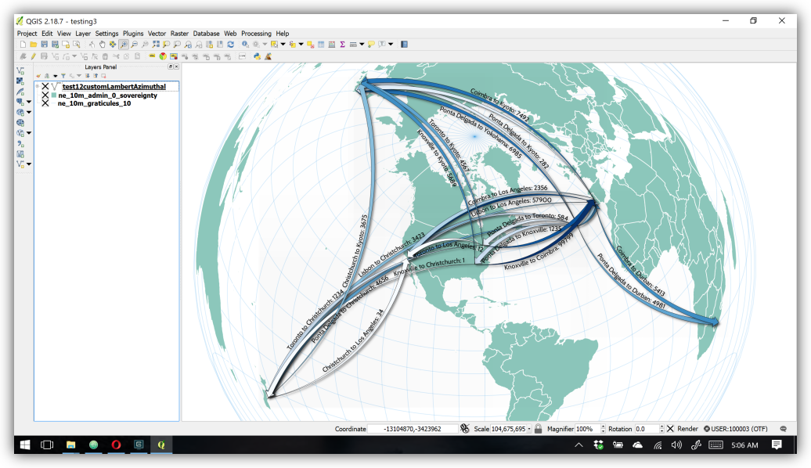

# FlowMaps

 

<small>The basemap used above from <a href="www.naturalearthdata.com" target="_blank">NaturalEarthData.com</a>.</small>

 

<small>Flows drawn for an azimuthal projection centered on Toronto.</small>

This Python script makes flow maps using mathematical interpolations between a start and an end point in a given map projection. The script takes one input file, being a CSV table of flows. It produces one output file in shapefile, geojson, kml, gml, or gmt format. For thorough usage information, please use the help flag from the command line:

<pre>python InterpolatedFlowMaps.py -h</pre>

Please note that the input CSV file must be in the format of the example below.  These headers, named exactly as seen, must be present and unique in the input file (though sequencing doesn't matter):

<pre>OrigName,OrigLat,OrigLon,DestName,DestLat,DestLon,FlowMag,SegFract,Dev,Straight,Opp</pre>

Any other headers and fields may also exist, and will be copied to the output features as text fields.  Text strings throughout may be enclosed in double quotes.  FlowMag values must be integer or decimal numbers.  To use textual magnitude data like "high" or "low," simply use some other unique column to store these data in, and they will be copied to the output file.  

All given coordinate values must be decimal latitude and longitude in WGS84 (the same coordinate system used my most online maps, and the GPS system).  

Example CSV:

The last four fields given above must exist, but can be empty. These are optionally used to tweak the inflection points and curving directions of individual arcs:

* `SegFract`. Represents the point along the straight line connecting the start and end points at which to construct an orthogonal vector, towards determining where a 3rd point that the arc must pass through will be. Must be a number above 0.0 and below 1.0.
* `Dev`. Represents the length of the orthogonal vector mentioned above, expressed as a fraction of the length of the straight line connecting the start and end points of the arc. Higher values make more arching curves, zero makes straight lines, and negative values cause the curve to go the other way.
* `Straight`. Represents a binary indicating whether this arc should be a straight line. Overrides any `Dev` value and sets it to 0.0. Use `1` to indicate a straight arc, and leave blank otherwise.
* `Opp`. Represents a binary indicating whether this arc should curve in the opposite direction as other arcs. While by default arcs curve in a clockwise direction, arcs using this option will go counterclockwise. Use `1` to indicate an opposite-direction-curving arc, and leave blank otherwise.

## Dependencies

* scipy
* gdal
* shapely
* pyproj

## Getting Started

1. Download the InterpolatedFlowMaps.py and testdata.csv files from this repository.  
2. I recommend using Anaconda as a Python package manager. Install Anaconda (or Miniconda). If you've already got it, skip this step. See [https://docs.conda.io/projects/conda/en/latest/user-guide/install/download.html](https://docs.conda.io/projects/conda/en/latest/user-guide/install/download.html).  
3. In a terminal, create a conda environment called `tryflows` with the necessary packages:  
`conda create -n tryflows python=3 scipy gdal shapely pyproj`
4. Activate your conda environment:  
`conda activate tryflows`  
5. Navigate to the folder where you’ve downloaded the .py file, e.g.,  
Linux, Mac, Unix-like systems: `cd /home/MyName/Downloads`  
Windows: `cd C:\Users\MyName\Downloads`  
6. Use your Anaconda Python environment to run the file, asking for the detailed help documentation:  
`python InterpolatedFlowMaps.py -h`  
7. Run the script on the provided demo data:  
`python InterpolatedFlowMaps.py testdata.csv testdata.shp`  

The script produces just the skeletal polylines for the flows. Once you have those, use your favorite GIS (e.g., QGIS at <a href="https://qgis.org" target="_blank">https://qgis.org</a>) to symbolize them, for example by drawing line or arrow widths according to the FlowMag attribute, as in the image at top.

The provided QML file can help you get started with symbolizing your flow lines in QGIS 3. It defines a classification scheme based on testdata.csv, some colors, a layer rendering order that draws flows with smaller FlowMag values on top of those with larger, a drop shadow, and an arrow size definition based on fractions of the FlowMag attribute (i.e., arrow end width, head width, and head length are each defined with an SQL-like statement dividing the value of FlowMag by the arbitrary value of 300). You'll almost certainly have to change the values for the class breaks and the symbol drawing and scaling parameters in the QGIS Layer Properties window to choices that fit your own data and map, but you can start by adjusting the values given in the QML file, after loading it using the menu option illustrated below.

 

## Usage and Citation

If you make maps with this, I'd love to hear about it (pauloj.raposo@outlook.com). If you're using this in an academic setting, please cite the presentation where it was first published:

<a href="https://www.youtube.com/watch?v=6rPWODqNpvg" target="_block">Raposo, P. (2017). Open-Source Flow Maps with Cubic Splines. Presented at the North American Cartographic Information Society (NACIS) Annual Meeting, Montreal, Canada.</a>

For more along these lines (get it?), see Anita Graser's excellent blog, <a href="https://anitagraser.com" target="_blank">https://anitagraser.com</a>, where she's frequently discussed flow maps and how to make them in QGIS. Other stuff by me can be found on <a href="https://paulojraposo.github.io" target="_blank">my website</a>.

Thanks for your interest!
