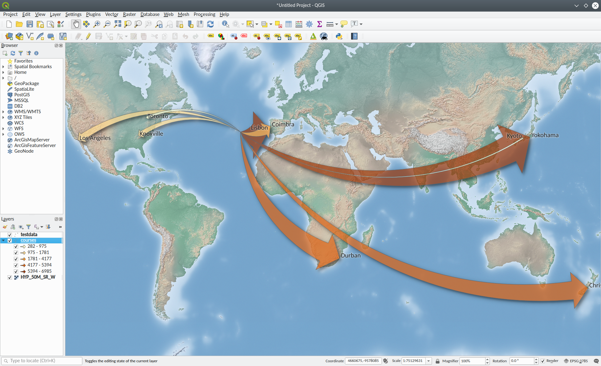

# FlowMaps

<br>

Makes flow maps using mathematical interpolations between a start and an end point in a given map projection.

The script takes one input file, being a CSV table of flows. It produces one output file in shapefile, geojson, kml, gml, or gmt format.

For thorough usage information, please use the help flag from the command line:

```
python InterpolatedFlowMaps.py -h
```

Please note that the input CSV file must be in the format of the example below.  The headers seen below, named exactly as seen, must be present and unique in the input file, though other headers/columns may exist (these will be ignored). Sequencing of the headers does not matter. Strings throughout may be enclosed in double quotes.  FlowMag variables can have decimals, but don't necessarily need to be numbers (e.g., they could be strings like "high" or "low") - these values are simply copied to the output geojson file.

All coordinate values must be latitude and longitude in WGS84.

Example CSV:

```
OrigName,OrigLat,OrigLon,DestName,DestLat,DestLon,FlowMag
Ponta Delgada,37.7483018179,-25.6665834976,Lisbon,38.7227228779,-9.1448663055,6013
Ponta Delgada,37.7483018179,-25.6665834976,Los Angeles,33.9899782502,-118.179980511,1661
Ponta Delgada,37.7483018179,-25.6665834976,Coimbra,40.2003743683,-8.41668034,2259
Ponta Delgada,37.7483018179,-25.6665834976,Christchurch,-43.5350313123,172.630020711,4656
Ponta Delgada,37.7483018179,-25.6665834976,Toronto,43.6999798778,-79.4200207944,584
Ponta Delgada,37.7483018179,-25.6665834976,Kyoto,35.0299922882,135.749997924,282
Ponta Delgada,37.7483018179,-25.6665834976,Yokohama,35.3200262645,139.58004838,6985
Ponta Delgada,37.7483018179,-25.6665834976,Durban,-29.8650130017,30.9800105374,4981
Ponta Delgada,37.7483018179,-25.6665834976,Knoxville,35.9700124298,-83.9200303566,1235
```

## Dependencies

* scipy
* gdal
* shapely
* pyproj


## Getting Started

1) Download the InterpolatedFlowMaps.py and testdata.csv files from this repository.
2) I recommend using Anaconda as a Python package manager. Install Anaconda (or Miniconda). If you've already got it, skip this step. See https://www.anaconda.com/distribution/.
3) In a terminal, create a conda environment called `tryflows` with the necessary packages:\
`conda create -n tryflows python=3.5 scipy gdal shapely pyproj`
4) Activate your conda environment:\
`conda activate tryflows`
5) Navigate to the folder where you’ve downloaded the .py file, e.g.,\
Linux, Mac, Unix-like systems: `cd /home/MyName/Downloads`\
Windows: `cd C:\Users\MyName\Downloads`
6) Use your Anaconda Python environment to run the file, asking for the detailed help documentation:\
`python InterpolatedFlowMaps.py -h`
7) Run the script on the provided demo data:\
`python InterpolatedFlowMaps.py testdata.csv testdata01.shp`

The script produces just the skeletal polylines for the flows. Once you have those, use your favorite GIS (e.g., QGIS at <a href="https://qgis.org" target="_blank">https://qgis.org</a>) to symbolize them, for example by drawing line or arrow widths according to the FlowMag attribute, as in the image at top.

The provided QML file can help you get started with symbolizing your flow lines in QGIS 3. It defines a classification scheme based on testdata.csv, some colors, a layer rendering order that draws flows with smaller FlowMag values on top of those with larger, and an arrow size definition based on fractions of the FlowMag attribute (i.e., arrow end width, head width, and head length are each defined with an SQL-like statement dividing the value of FlowMag by the arbitrary value of 300). You'll almost certainly have to change the values for the class breaks and the symbol drawing and scaling parameters in the QGIS Layer Properties window to choices that fit your own data and map, but you can start by adjusting the values given in the QML file, after loading it using the menu option illustrated below.

<br>

For more along these lines (get it?), see Anita Graser's excellent blog, <a href="https://anitagraser.com" target="_blank">https://anitagraser.com</a>, where she's frequently discussed flow maps and how to make them in QGIS.

Thanks for your interest, and I hope the script is useful and fun to use for you!
